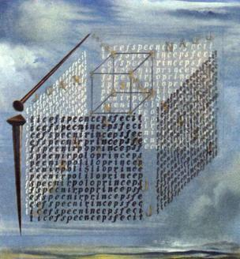

 

      

 
<h1 align="center">
    Rusty Cryptoeconomics
</h1>

This project explores blockchains from first principles, starting with a centralized b2c database and iteratively building towards a decentralized p2p database (aka a blockchain). The goal is to build a foundation of knowledge from basic crypto and blockchain concepts, and then use that to think about and build arbitrary cryptoeconomic mechanisms that get people to do stuff that would otherwise become a tragedy of the commons. It's a WIP and comments/ideas/contributions are warmly welcome :)  

 
<h2 align="center">
    <a href="https://burrrata.github.io/rusty_cryptoeconomics/intro.html">Check it out!</a>
</h2>
 
