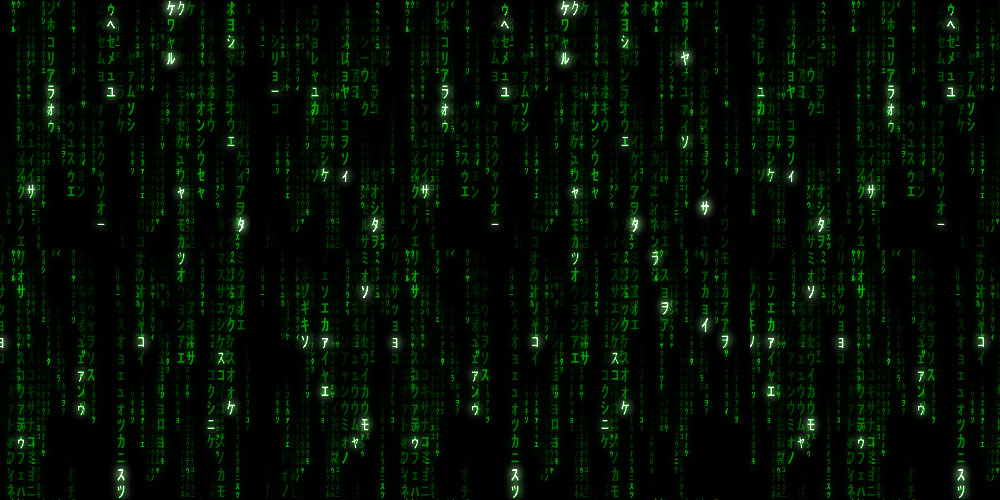

<br>

<div align="center">
    <p align="center">
        
    </p>
    <h1 align="center">
        State
    </h1>
    <p align="center">
        All the things...
    </p>
</div>

<br><br><br>

So as we mentioned, a blockchain is a glorified database. As such, at it's heart is some data. Like any database that changes, the current state of things is literally called the "state". As we saw with a centralized database the owners of that database can change the state however and whenever they want. In a decentralized system where there is no centralized database manager, the state is agreed upon by a distributed group of verifiers based on some consensus rules that they all agree to.

In a Proof of Work blockchain the state is divided by blocks; each new block representing a new world state. Users submit requests to change the state in the form of transactions (tx) and verifiers check those transactions and aggregate them into blocks. In order to publish a block that is accepted as the next state, the verifier has to perform computation to solve a puzzle. This is where the term "proof of work" comes in, because you can only solve the puzzle if you did the work. Whoever solves the puzzle gets to publish the next block, and there is a reward for doing so called the "block reward". This does a few things:
- it creates new tokens to incentivize people to spend resources to check and secure blocks
- it prevents anyone from just publishing spam blocks arbitrarily
- because there is a reward for publishing valid blocks and every block can be checked by the entire network, anyone who publishes a fake block will be ignored, thus preventing fraud on the network

All in all this accomplishes something that was not possible before: a shared state that people can trust to be a legitimate source of information. Before you had to trust a centralized operator because it was to complicated for a large network to process and manage a complex state asynchronously. With blockchain technology however, this is possible. In this chapter we'll explore the simplest version of this: a financial transaction network that uses proof of work to solve a simple puzzle. 

### Idea To Add
- because accounts are not in a centralized database the user controls the account, and as long as the network is operational, the user's account is too. Just like if your bank went under (https://en.wikipedia.org/wiki/Lehman_Brothers), your account would be gone, if the P2P network you're on goes under same deal. 

## Code

```rust
use std::collections::HashMap;

// First we're going to create a struct that will hold the important state data we want to keep our database functioning:
// - accounts: this is where people's money and addresses live
// - pending_tx: a pool of pending tx that have not yet been verified as legit or not
// - chain: this is where TX that have been verified and processed are stored. Think of it as the history, but rather than a bank telling you what your balance is, you can check the history to make sure everything is legit. 

#[derive(Debug)]
struct State {
    modulo: i32,
    accounts: HashMap<i32, Account>,
    pending_tx: Vec<SignedTX>,
    chain: Vec<Block>,
}

// As promised, accounts have a balance.
// They also have a nonce which is used to add a unique 
// serial number to every tx and prevent duplicates from
// being processed. 
#[derive(Debug, Clone)]
struct Account {
    balance: f32,
    nonce: i32,
}

// TX stands for transaction.
// Sender, receiver, and amount are what they say they are.
// Like we said, the nonce is a unique value added to every
// TX to prevent duplicates from being processed.
#[derive(Debug, Clone)]
struct TX {
    sender: i32,
    receiver: i32,
    amount: f32,
    nonce: i32,
}

// The sender of every TX signs it to verify that it came
// from them and not someone else. This is done via hashing
// and public key crypto, which we'll explore soon. 
#[derive(Debug, Clone)]
struct SignedTX {
    tx: TX,
    signature: Vec<i32>,
}

// The blockheader is attached to every block to provide
// information such as when the block was produced (timestamp),
// a unique identifier (nonce), the hash of the previous block
// to verify the correct ordering of blocks, and a merkle 
// hash that acts as a signature of this block that the next
// block can reference. Hashing and linking these blocks 
// together like this is what leads to the term "blockchain".
// (because it's a chain of blocks)
#[derive(Debug, Clone)]
pub struct Blockheader {
    timestamp: i64,
    nonce: i32, 
    previous_block_hash: String,  
    merkle: String,  
}

// Each block holds the information in the block header
// as well as all the TX that were processed in that block.
// Because of this anyone can verify the authenticity of the
// history, and you can't rewrite the history without 
// rewriting every block that comes after it. When there's
// a cost for creating blocks this is very difficult, and
// this is what leads people to trust that blockchains are
// secure. With a centralized operator though, this does not
// apply. For this reason, in this chapter we'll refer to the
// database as a "blockchain" because it's architecture is
// inspired by blockchains, but has none of the security
// guarantees of decntralized P2P blockchains.
#[derive(Debug, Clone)]
pub struct Block {
    header: Blockheader,
    transactions: Vec<SignedTX>
}

// This function initializes a new "blockchain" inspired
// data structure.
impl State {

    // Initialize A "Blockchain"
    pub fn new_blockchain() -> State {
        let mut state = State {
            modulo: 0,
            accounts: HashMap::new(),
            pending_tx: Vec::new(),
            chain: Vec::new(),
        };
    
        state
    }  
}

// Let's try it out. If you push play you'll see that the
// program creates a new state. It's empty, but soon we'll
// start filling it with data.
fn main() {

  let state = State::new_blockchain();
  println!("{:#?}", state);

}
```

## Resources

The Ethereum Whitepaper: state machine sections
- https://github.com/ethereum/wiki/wiki/White-Paper#bitcoin-as-a-state-transition-system
- https://github.com/ethereum/wiki/wiki/White-Paper#ethereum-state-transition-function

The Ethereum Yellowpaper: 2. The Blockchain Paradigm
- "Ethereum, taken as a whole, can be viewed as a
transaction-based state machine: we begin with a genesis
state and incrementally execute transactions to morph
it into some final state. It is this final state which we
accept as the canonical “version” of the world of Ethereum.
The state can include such information as account balances,
reputations, trust arrangements, data pertaining
to information of the physical world; in short, anything
that can currently be represented by a computer is admissible.
Transactions thus represent a valid arc between two
states; the ‘valid’ part is important—there exist far more
invalid state changes than valid state changes. Invalid state
changes might, e.g., be things such as reducing an account
balance without an equal and opposite increase elsewhere."
- https://ethereum.github.io/yellowpaper/paper.pdf

A history of state machines
- https://en.wikipedia.org/wiki/Analytical_Engine
- https://en.wikipedia.org/wiki/Turing_machine#The_%22state%22
- https://en.wikipedia.org/wiki/Transition_system
- https://en.wikipedia.org/wiki/Blockchain
