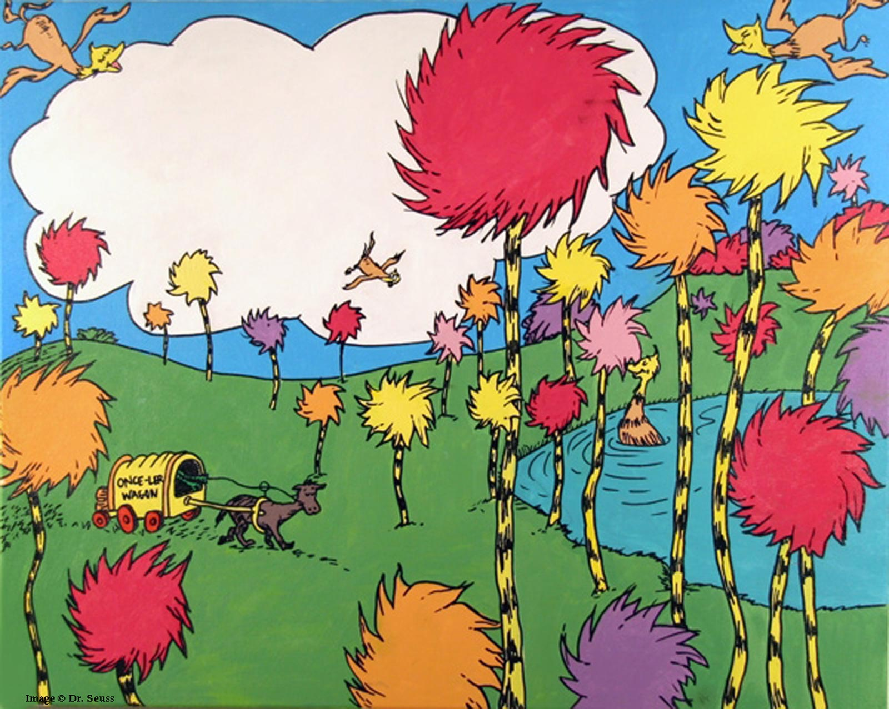

    

        
    

    <h1 align="center">
        Minimal Viable Proof of Stake "Blockchain"
    </h1>
    

        Because you can't eat money.
    

 

## Words

In this chapter we'll transition our PoW "blockchain" style network towards a PoS network. This has many benefits:
- we don't consume physical resources for digital security
- we can create more compelling incentive mechanisms
- we can destroy an attacker's ability to make repeated attacks

The future is near. Let's get started!

 
