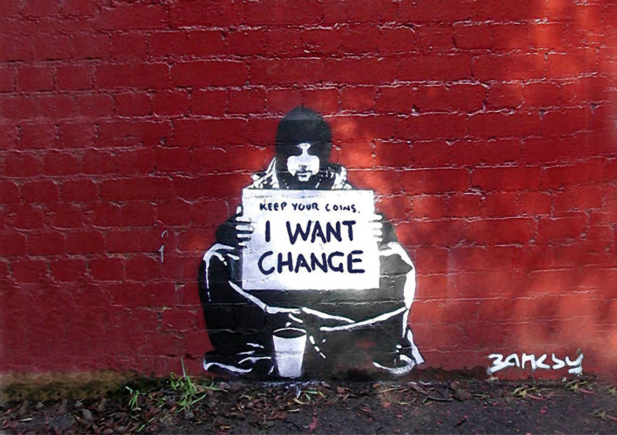

<br>

<div align="center">
    <p align="center">
        
    </p>
    <h1 align="center">
        Scaling
    </h1>
    <p align="center">
        How many tx could a woodchuck chuck if a woodchuck could chuck tx?
    </p>
</div>

<br><br><br>

Core Concepts
- To scale beyond payments or very important infrequent stuff, we need to create a network that is secure but can also process many many tx quickly.

<br><br><br>

Videos TBD

<br><br><br>

```rust, ignore
// code TBD
```

<br><br><br>

### Resources To Learn More
- TBD

<br><br><br>
