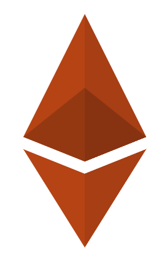

 

    

          
    

     
    <h1 align="center">
        Welcome!
    </h1>

   

A blockchain is, at it's heart, just a glorified database. It keeps track of stuff. In this book we'll explore how that works and why anyone should care.

There's a lot of data in the world. More and more everyday. While data can be useful, it's most useful to those who have access to it. Those In today's world that means banks, social networks, and governements. Take a look at their market caps as well as their influence over the state of things. There's a direct correlation between access to data and power and wealth. It's a zero sum game. If you're not a bank, social network, or government this sucks.

Good news though! There's this cool thing called Free Open Source Software, and there's a subset of that called P2P decentralized technology, and there's a subset of that called blockchains. Why do these matter? Well because silly... they're free for anyone to use and the networks are P2P so the users control the networks and data, and thus, keep the value they create. The magic of blockchains specifically is that they align incentives in a way that gets people to do stuff that benefits them individually as well as the network as a whole. It's a positive sum win/win game. The is achieved in a variety of ways depending on the blockchain, but common stakeholders include:
- people who use the network to do stuff,
- people who develop the code that the network runs on,
- and people who contribute to the security of the network by verifying and creating blocks of transactions. 

These stakeholders are incentivized to contribute to the health and growth network because they derive value from it. This can come in the form of direct monetary incentivization for miners to verify and create blocks, developers wanting to build things that people actually use so that their dApp tokens are valued highly, or users signalling their preferences by using things they like and dropping things that don't work. If this system is balanced, secure, and correctly designed all parties involved will benefit more than they would otherwise. This magic alchemy is often referred to as cryptoeconomics. Why? Well the network is built out of code, and code can verify things and keep them secure (crypto). Also, people who use and participate in the network recieve value for doing so (economics). 

This tutorial will explore the basic components that go into building cryptoeconomic systems. This will start with the traditional centralize payment processors we know and hate, and will progressively move towards more and more decentralized systems secured and maintained through cryptoeconomics rather than corporate interests. Let the games begin!

   
