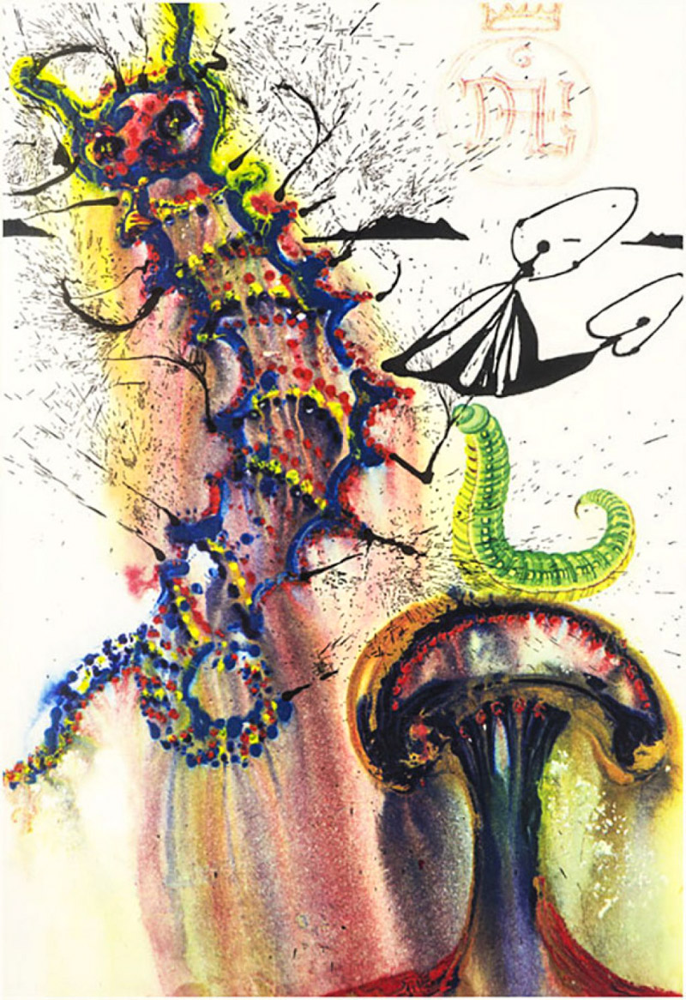

      

<h1 align="center">
    Inspo: thoughts and dreams.
</h1>

 

## Ch 4: Harder Better Faster Stronger
- https://www.parity.io/substrate/
- https://substrate.readme.io/docs
- https://github.com/paritytech/substrate
- ecdsa
- rlp
- scale
- patricia tries
- etc...

It would be so lit to replicate something like Polkadot within a fun tutorial!
- https://github.com/ethereum/wiki/wiki/Chain-Fibers-Redux
- 2.2. Previous work: https://polkadot.network/PolkaDotPaper.pdf
- https://github.com/paritytech/polkadot

## Stuff to (maybe) build

99% Fault Tolerant Consensus
- https://vitalik.ca/general/2018/08/07/99_fault_tolerant.html
- https://www.youtube.com/watch?v=l0AQ0UJAvM8

Casper FFG Testnet (PoS)
- https://hackmd.io/s/Hk6UiFU7z

Sharding
- https://github.com/ethereum/wiki/wiki/Sharding-roadmap

Pyethereum Serenity Draft
- https://github.com/ethereum/pyethereum/tree/serenity/

 

## Cryptoeconomics
- The revolution will be incentivized.

Ye Olde Cryptoeconomics
  - https://en.wikipedia.org/wiki/Common-pool_resource
  - https://evonomics.com/tragedy-of-the-commons-elinor-ostrom/

Token Engineering
  - http://tokenengineering.net/building-blocks

Applications
  - https://colony.io/
  - https://ethresear.ch/c/applications

Voting Systems
  - https://medium.com/@Vlad_Zamfir
  - https://www.coindesk.com/the-dark-dao-threat-vote-vulnerability-could-undermine-crypto-elections
  - http://hackingdistributed.com/2018/07/02/on-chain-vote-buying
  - https://pdaian.com/blog/vote-buying-on-chain-governance-and-quadratic-plutocracy

Small vs Large Games
  - https://unenumerated.blogspot.com/2015/05/small-game-fallacies.html

Dystopia (things we want to avoid that blockchains could easily amplify)
  - https://en.wikipedia.org/wiki/Social_Credit_System
  - https://www.reuters.com/investigates/special-report/venezuela-zte/
  - https://www.npr.org/sections/thesalt/2018/09/29/643386327/no-cash-needed-at-this-cafe-students-pay-the-tab-with-their-personal-data
  - https://www.coindesk.com/the-little-known-ways-ethereum-reveals-user-location-data
  - https://ethereum.karalabe.com/talks/2018-devcon.html#1

goals
  - https://vitalik.ca/jekyll/general/2017/03/11/a_note_on_charity.html
  - https://ethresear.ch/t/question-for-game-theory-experts-coalitions-with-and-without-a-concentrated-beneficiary/3859
  - http://www.paulgraham.com/good.html

 

## Crypto Stuff

Bulletproofs
- https://eprint.iacr.org/2017/1066.pdf
- https://www.grin-forum.org/t/confidential-assets/1217
- https://medium.com/interstellar/programmable-constraint-systems-for-bulletproofs-365b9feb92f7
- https://crypto.stanford.edu/bulletproofs/
- https://doc.dalek.rs/bulletproofs/index.html
- https://github.com/dalek-cryptography/bulletproofs
- https://doc-internal.dalek.rs/bulletproofs/notes/index.html

Confidential Assets
- https://www.grin-forum.org/t/confidential-assets/1217 https://blog.chain.com/hidden-in-plain-sight-transacting-privately-on-a-blockchain-835ab75c01cb https://blockstream.com/bitcoin17-final41.pdf

Dandelion
- https://github.com/mimblewimble/grin/blob/master/doc/dandelion/dandelion.md https://github.com/gfanti/bips/blob/master/bip-dandelion.mediawiki

One Way Aggregate Signatures
- https://download.wpsoftware.net/bitcoin/wizardry/horasyuanmouton-owas.pdf

Scriptless Scripts
- https://www.grin-forum.org/t/scriptless-scripts-research-material/610 
- https://github.com/mimblewimble/grin/blob/master/doc/contracts.md
- https://diyhpl.us/wiki/transcripts/mit-bitcoin-expo-2017/mimblewimble-and-scriptless-scripts/ 
- https://lists.launchpad.net/mimblewimble/msg00029.html 
- https://lists.launchpad.net/mimblewimble/msg00036.html "I think it's possible to extend to pretty much any script functionality (though I don't want to)"
- https://lists.launchpad.net/mimblewimble/msg00029.html
- https://bitcoinmagazine.com/articles/bitcoin-privacycoin-tech-making-bitcoin-more-private/ 
- https://bitcoinmagazine.com/articles/scriptless-scripts-how-bitcoin-can-support-smart-contracts-without-smart-contracts/ 
- https://joinmarket.me/blog/blog/flipping-the-scriptless-script-on-schnorr/

Schorr Signatures
- https://en.wikipedia.org/wiki/Schnorr_signature
- https://en.wikipedia.org/wiki/Schnorr_group
- https://www.grin-forum.org/t/schnorr-signatures-in-grin-information/730
- https://github.com/mimblewimble/grin/blob/master/doc/contracts.md
- https://diyhpl.us/wiki/transcripts/scalingbitcoin/milan/schnorr-signatures/
- https://diyhpl.us/wiki/transcripts/blockchain-protocol-analysis-security-engineering/2018/schnorr-signatures-for-bitcoin-challenges-opportunities/

 

## Random Thoughts

 

### An evolution of human cooperation part 1

From what I can tell, it seems that cooperation is the fundamental thing that has allowed humans to overcome major difficulties and become the dominant species on the planet. For a while this worked really well in tribes where people knew each other and established reputation, and ten in top down command and control systems where one gov/religion would coordinate all it’s members to get stuff done (build churches/pyramids, invade less coordinated small tribes, etc…).

Today though, we live in a global 24/7 interconnected world where these institutions are ill-equipped to take on our current challenges such as environmental challenges (tragedy of the commons), border-less culture/businesses/information (permission-less innovation), and a general inability for people to secure or verify information and value (and thus make informed decisions). We cannot solve these problems with the same level of thinking that created them, but we can evolve our coordination mechanisms to meet these demands.

This is where cryptoeconomics comes in: it’s an evolution of human cooperation. History has shown that cooperation is possible, and the species, cultures, and societies that understood this are the ones that survived and thrived. We need mechanisms that enable this at scale. This means trustless 24/7 always on, always secure, selfishly incentivized positive sum global systems. This means blockchains and cryptoeconomics.

### An evolution of human cooperation part 2

Monarchies: I have a big stick and god gave it to me, and god has a big stick too, so do as I say otherwise we’ll hit you with a big metal/moral stick.

Capitalism: I have lots of money to buy lawyers and equities and our gov enforces and supports money, laws, and equities, so do as I say otherwise we’ll hit you with a big and expensive legal/physical stick.

Cryptoeconomics: there’s things to be done and if you want to do them you’ll be rewarded with X, but there’s also other things you could try to do and if you do you’ll be punished with Y, so do whatever you want :v:️

Cryptoceonomics, if implemented correctly, might help to replace/minimize many institutions and practices we use today to reach consensus or enforce behaviors. That being said, there’s still a place for legal processes and voting, but they are often overused and inefficient for many usecases. Cryptoeconomics can help us optimize incentive verification and enforcement just like software and computers helped us optimize database entry and management :slight_smile:

 

### Privacy as a foundation of "censorship resistance"

When all information is public knowledge influence and manipulation through signaling or coercion become significant factors. While the base layer protocols are cryptoeconomically secure, the applications and platforms built on top of the base layer, or even applications and services related to the blockchain that aren’t on the blockchain at all (I’m looking at you marketing/advertising), are bottlenecks where censorship and permission allow for walled gardens and regulatory influence. These are also the layers where 99% of people actually engage with and use applications.

Think about the internet: all of the protocols themselves are relatively ok, and for a while the web promised the same goals of permission-less innovation and decentralization that we love talking about, but it’s the applications built on top of those protocols that captured all the value and hold all the power. While the protocol might not censor emails, Gmail certainly can. While Ethereum might not censor a tx, Coinbase certainly can. Most users don’t care, but the promise of cryptoeconomics (in my mind) is to create positive sum incentive systems where users of the system are rewarded for contributing to that system (and punished for not). This really isn’t possible if all data is publicly available and 2nd layer solutions and on/off ramp services can influence and censor access for their own interests rather than the interests of the on-chain communities.

 

 
